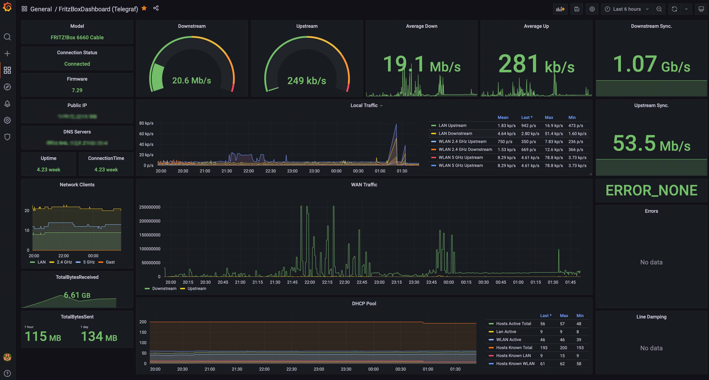

# Telegraf Fritz!Box Monitoring

This project contains a Python application to collect metrics from a Fritz!Box and push the monitoring data into a InfluxDB for visualization in Grafana.
For collecting the metrics, the [TR-064 protocol](https://avm.de/service/schnittstellen/) of AVM is used via the library [fritzconnection](https://github.com/kbr/fritzconnection).

The basis of this project was [TelegrafFritzbox](https://github.com/Schmidsfeld/TelegrafFritzBox).
Since it is inactive and has some issues with cable routers, this project is a complete rewrite with some enhancements:

* Object-oriented codebase with smaller classes for better maintenance
* No configuration of cable/DSL routers required (system selects by itself)



# Compatibility
Any cable or DSL Fritz!Box routers should work without any special configuration.

The application was tested with:

* Fritz!Box 6660 Cable Router
* Fritz!Box 7412 DSL Router

This application uses also mostly the same names as [TelegrafFritzbox](https://github.com/Schmidsfeld/TelegrafFritzBox).
It allows reusing existing Grafana Dashboards without big changes.

# Output
* The output is formatted in the influxDB format. 
* By default the influxDB dataset FritzBox will be generated
* All datasets are tagged by the hostname of the router and grouped into different sources
* All names are sanitized (no "New" in variable names)
* All variables are cast into appropriate types (integer for numbers, string for expressions and float for 64bit total traffic)

## Install
## Prerequisites
* Telegraf, InfluxDB, Grafana is already installed
* TR-064 protocol was activated in the Fritzbox:
  * `Heimnetz -> Netzwerk -> Netzwerkeinstellungen`
* Recommended: Have a dedicated user on the Fritz!Box (for example: fritz-mon)
* Clone the project to your server instance

## Installation
First clone the project and edit the file `telegraf_fritzbox.conf` to configure the Fritz!Box IP address and credentials.

You need to install pip (Ubuntu example):
```bash
sudo apt install python3-pip
sudo pip3 install -r requirements.txt
sudo ./install.sh
```

To check if everything is working, you can execute the `command` from the `telegraf_fritzbox.conf` file in your shell.
If everything is fine, it outputs data like this:

```
FritzBox,host=fritzbox7412,source=general ModelName="FRITZ!Box 7412 (UI)",Firmware="None",WANAccessType="None",SerialNumber="A31A141A332E"
FritzBox,host=fritzbox7412,source=status UpTime=4394708i,ConnectionStatus="Connected",LastError="ERROR_NONE"
...
```

If everything works, restart telegraf:
```bash
systemctl restart telegraf
```

Now you can import the Grafana Dashboard. It might be required to change the datasource, if the telegraf database is not the default datasource.
